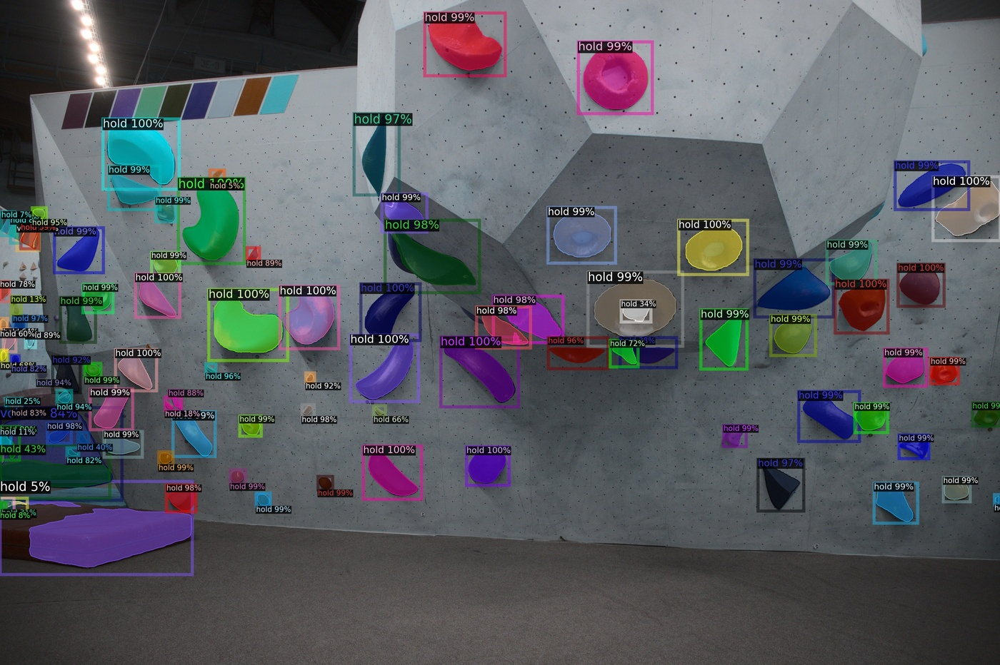

# Indoor Climbing Hold and Route Segmentation
This repository contains the source code for the [Indoor Climbing Hold and Route Segmentation](https://github.com/xiaoxiae/Indoor-Climbing-Hold-and-Route-Segmentation/tree/main/paper/main.pdf) project, created as a final assignment for the [Computer Vision: 3D Reconstruction](https://hci.iwr.uni-heidelberg.de/content/computer-vision-3d-reconstruction-ws-2223) course (University of Heidelberg).



## Abstract
_Image segmentation has uses in a wide variety of fields, including medicine, geography, and sport. For indoor rock climbing specifically, the main task is the segmentation of the holds which the climbers use to scale the wall. Furthermore, since holds of the same color form routes, the secondary task is to find these routes. A number of approaches have been devised to solve these two tasks, with the two major categories being learning and non-learning approaches. We have tested and implemented both learning and non-learning (standard) approaches for these tasks, finding the learning approaches far superior in terms of accuracy, but less practical due to the need for good training data, which has to be obtained manually._

## Obtaining data
The data used, including the best-performing model weights, can be obtained from Kaggle: https://www.kaggle.com/datasets/tomasslama/indoor-climbing-gym-hold-segmentation

## Running the code
A short demo of the implemented functionality can be found in `demo.ipynb`.

Alternatively, you can run the ML hold and route detection straight on Kaggle without downloading anything:

- Hold Segmentation: https://www.kaggle.com/code/tomasslama/hold-segmentation/
- Route Segmentation: https://www.kaggle.com/code/tomasslama/route-segmentation/

## Folder structure

```
.
├── data/
│   ├── bh/               # Bolderhaus camera VIA annotations
│   ├── bh-phone/         # Bolderhaus phone VIA annotations
│   ├── sm/               # Smíchoff camera VIA annotations
│   ├── *.py              # dataset utility scripts
│   └── statistics.ipynb  # dataset statistics
├── ml/                   # machine learning approach
├── std/                  # standard approach
├── paper/                # paper source code
└── demo.ipynb            # code demo
```
